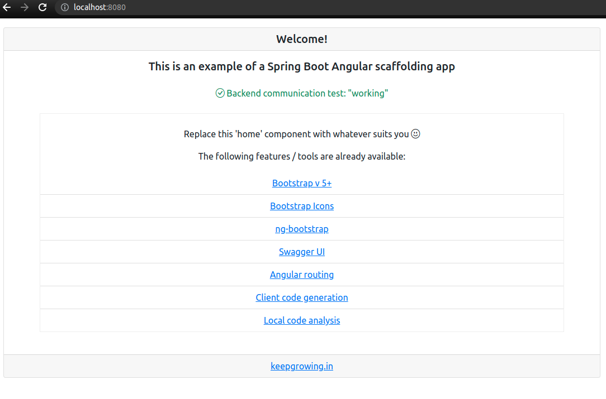

# spring-boot-angular-scaffolding


[](https://sonarcloud.io/dashboard?id=little-pinecone_spring-boot-angular-scaffolding)
[](https://sonarcloud.io/dashboard?id=little-pinecone_spring-boot-angular-scaffolding)
[](https://sonarcloud.io/dashboard?id=little-pinecone_spring-boot-angular-scaffolding)

[](https://sonarcloud.io/dashboard?id=little-pinecone_spring-boot-angular-scaffolding)
[](https://sonarcloud.io/dashboard?id=little-pinecone_spring-boot-angular-scaffolding)
[](https://sonarcloud.io/dashboard?id=little-pinecone_spring-boot-angular-scaffolding)
[](https://sonarcloud.io/dashboard?id=little-pinecone_spring-boot-angular-scaffolding)
[](https://sonarcloud.io/dashboard?id=little-pinecone_spring-boot-angular-scaffolding)


To learn how to set up a project like this one, check out the [Integrate Angular with a Spring Boot project](http://keepgrowing.in/java/springboot/integrate-angular-with-a-spring-boot-project/)
post.

This project is a multi-module application, using the following frameworks: Spring Boot for the backend and Angular for
the frontend. The project can be built into a single jar file using Maven.

- [Getting Started](#getting-started)
  * [Prerequisites](#prerequisites)
  * [Running the project](#running-the-project)
- [Profiles summary](#profiles-summary)
  * [Spring profiles](#spring-profiles)
  * [Maven profiles](#maven-profiles)
- [API documentation](#api-documentation)
  * [Swagger](#swagger)
  * [OpenAPI](#openapi)
- [Client code generation](#client-code-generation)
- [Working with frontend on a local environment](#working-with-frontend-on-a-local-environment)
- [Running test suits](#running-test-suits)
  * [Backend](#backend)
  * [Frontend](#frontend)
- [SonarQube analysis on a local environment](#sonarqube-analysis-on-a-local-environment)
  * [SonarQube Prerequisites](#sonarqube-prerequisites)
  * [Full analysis](#full-analysis)
  * [Backend analysis](#backend-analysis)
  * [Frontend analysis](#frontend-analysis)
  * [Verifying results](#verifying-results)
- [Forking this repository](#forking-this-repository)
- [Built With](#built-with)

## Getting Started

### Prerequisites

Backend:

* [JDK 13+](https://adoptopenjdk.net/archive.html)
* [Maven](https://maven.apache.org/) (or you can use `mvnw` provided in the project)
* [Docker](https://www.docker.com/)
* [Docker Compose](https://docs.docker.com/compose/)

Frontend:

* Node.js version that you specify in the `frontend-maven-plugin` configuration - 
[Angular requires](https://angular.io/guide/setup-local#prerequisites) an [active or maintenance LTS](https://nodejs.org/en/about/releases/) 
version of Node.js. For the reference, you can check out this [unofficial compatibility matrix](https://gist.github.com/LayZeeDK/c822cc812f75bb07b7c55d07ba2719b3).

### Running the project

First, [clone](https://docs.github.com/en/github/creating-cloning-and-archiving-repositories/cloning-a-repository-from-github/cloning-a-repository)
this repository.

Then, build it locally with:

```shell
mvn clean install
```

You can run the project from command line with:

```shell
mvn spring-boot:run -Dspring-boot.run.profiles=dev
```

As a result, you should be able to visit the home page on [http://localhost:8080/](http://localhost:8080/):



## Profiles summary

The project can be built with various different profiles to allow for flexible configuration. Below you'll find a short
summary of the available profiles.

### Spring profiles

* `dev` - for local development. Allows things like handling requests from `http://localhost:4200/`.
* `angular` - special profile used for [client code generation](https://codesoapbox.dev/generate-client-code-from-spring-boot-using-maven/). 
Applied automatically when the `angular` Maven profile is enabled.

### Maven profiles

* `sonar-cloud` - for code analysis on push to `master`
* `code-coverage` - for including code coverage reports from the `backend` module during a sonar analysis
* `frontend-pre-sonar` - for including code coverage reports from the `frontend` module during a sonar analysis
* `frontend-sonar` - for running only a sonar analysis for the `frontend module`
* `angular` - for [generating client code](https://codesoapbox.dev/generate-client-code-from-spring-boot-using-maven/)

## API documentation

The backend module serves one endpoint for testing purposes. First, build and run the application. Then you'll be able
to reach the API docs.

### Swagger

The Swagger UI page: [http://localhost:8080/swagger-ui.html](http://localhost:8080/swagger-ui.html).

### OpenAPI

* The OpenAPI description in the `json` format is available at the following
url: [http://localhost:8080/v3/api-docs](http://localhost:8080/v3/api-docs).
* The API specification is also available in the `yaml` format under the 
[http://localhost:8080/v3/api-docs.yaml](http://localhost:8080/v3/api-docs.yaml) link.

## Client code generation

To run [client code generation](https://codesoapbox.dev/generate-client-code-from-spring-boot-using-maven/) 
using the `openapi-generator-maven-plugin` execute the following command:

```shell
cd backend
mvn clean verify -Pangular -DskipTests
```

The application will be started so that the API specification can be obtained from the Open API endpoint.

The generated code is available in the `frontend/src/main/angular/src/backend` directory. Don't edit those files manually.

## Working with frontend on a local environment

If you want to see how changes you make in the frontend code affect the application you don't need to build it together
with the `backend` module every time (`mvn clean install`). Use the following commands:

```shell
mvn spring-boot:run -Dspring-boot.run.profiles=dev
```

```shell
cd frontend/src/main/angular
ng serve
```

and visit [http://localhost:4200/](http://localhost:4200/). The frontend application reloads automatically on code change.

## Running test suits

### Backend

Run unit tests with the following command in the project directory:

```shell
mvn test
```

Run all tests with the following command in the project directory:

```shell
mvn verify
```

### Frontend

Run all tests for the Angular code with:

```
cd frontend/src/main/angular
ng test
```

## SonarQube analysis on a local environment

### SonarQube Prerequisites

* Read the [Boost project quality with SonarQube – local code analysis](https://keepgrowing.in/tools/boost-project-quality-with-sonarqube-local-code-analysis/)
  post to set up dependencies properly.
* You'll need Chrome installed on your machine for running a frontend analysis with code coverage.
* Read the [How to add an Angular module built with Maven to a SonarQube analysis](https://keepgrowing.in/angular/how-to-add-an-angular-module-built-with-maven-to-a-sonarqube-analysis/) 
to learn more about analysing a multi-module maven application.
  

### Full analysis

You can run analysis for the **whole project** (both backend and frontend):

```shell
mvn clean verify sonar:sonar -Pfrontend-pre-sonar -Pcode-coverage -Dsonar.login=your_username -Dsonar.password=your_password
```

### Backend analysis

You can run a separate analysis for the **backend** module:

```shell
cd backend
mvn clean verify sonar:sonar -Pcode-coverage -Dsonar.login=your_username -Dsonar.password=your_password
```

### Frontend analysis

You can run a separate analysis for the **frontend** module:

```shell
cd frontend
mvn sonar:sonar -Pfrontend-pre-sonar -Dsonar.login=your_username -Dsonar.password=your_password
```

Or use the shell script which you can find in the closing paragraphs of
the [How to add an Angular module built with Maven to a SonarQube analysis](https://keepgrowing.in/angular/how-to-add-an-angular-module-built-with-maven-to-a-sonarqube-analysis/)
post.

### Verifying results

Visit the [Projects](http://localhost:9000/projects) page and choose the right project. Depending on which modules were
analysed you should see one, two, or three projects.

## Forking this repository

### Update project metadata

* Make sure to provide your own values for `<name>`, `<description>`, `<artifactId>` and `<groupId>` in the `pom.xml`, 
`backend/pom.xml` and `frontend/pom.xml` files.
  
### GitHub Actions and SonarCloud analysis

* Remove the `.github/workflows/build.yml` file if you don't want to configure GitHub Actions for your repository.
* If you don't want to configure SonarCloud for your repository: remove the `sonar-cloud` profile from `pom.xml`, 
  `<sonar.projectKey>` and `<sonar.projectName>` from `backend/pom.xml` and all `<sonar…>` properties from 
  `frontend/pom.xml`
* If you do want to configure GitHub Actions and SonarCloud analysis, add your own SONAR_TOKEN to your repository 
and customize all mentioned above`<sonar…>` properties in the `pom.xml` files.

## Built With

* [Maven](https://maven.apache.org/)
* [Spring Boot v2.5+](https://start.spring.io/)
* [Angular v12+](https://angular.io/)
* [frontend-maven-plugin](https://github.com/eirslett/frontend-maven-plugin)
* [springdoc-openapi](https://springdoc.org/)
* [Bootstrap v5+](https://getbootstrap.com/docs/5.0/getting-started/introduction/)
* [ng-bootstrap](https://ng-bootstrap.github.io/#/home)

<small><i><a href='http://ecotrust-canada.github.io/markdown-toc/'>Table of contents generated with markdown-toc</a></i></small>
